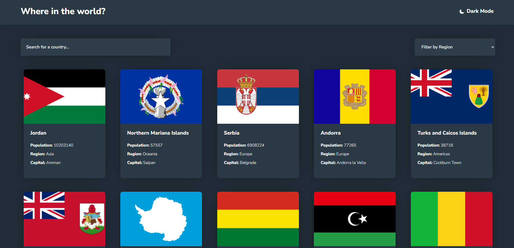

# Frontend Mentor - REST Countries API with color theme switcher solution

This is a solution to the [REST Countries API with color theme switcher challenge on Frontend Mentor](https://www.frontendmentor.io/challenges/rest-countries-api-with-color-theme-switcher-5cacc469fec04111f7b848ca). Frontend Mentor challenges help you improve your coding skills by building realistic projects. 

## Sreenshot

## Adventages

- Switching between dark and light theme.
- Filtering countries by ``input`` and ``select`` field.
- Click on a country to see more details about country on a separate page.
- Click through to the border countries on the detail page
